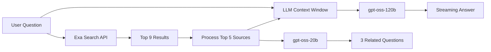

<div align="center">

# NeuroSearch


**An open-source AI-powered search engine with real-time streaming responses**

[](https://nextjs.org)
[](https://tailwindcss.com)
[](https://groq.com)
[](LICENSE)

[Live Demo](https://www.neurosearch.com) • [Documentation](https://console.groq.com/docs) • [Report Bug](https://github.com/yourusername/neurosearch/issues)

</div>

---

## 📖 About

NeuroSearch is an open-source AI search engine that combines the power of large language models with real-time web search to provide accurate, cited answers. Built with Next.js and powered by Groq's ultra-fast inference, it delivers streaming responses with source attribution.

> 💡 **Want to learn how to build this?** Check out [**the official tutorial**](https://console.groq.com/docs)!

## ✨ Features

- 🔍 **Real-time Web Search** - Leverages Exa.ai for high-quality, relevant search results
- ⚡ **Ultra-fast Inference** - Powered by Groq's LPU technology for near-instant responses
- 📝 **Streaming Responses** - Answers stream in real-time for a smooth user experience
- 📚 **Source Attribution** - Displays top search results alongside AI-generated answers
- 🔄 **Related Questions** - Automatically suggests follow-up questions based on your query
- 📊 **Observability** - Integrated with Helicone for monitoring and analytics
- 🎨 **Modern UI** - Clean, responsive interface built with Tailwind CSS

## 🛠️ Tech Stack

| Category | Technology |
|----------|------------|
| **Framework** | Next.js 14 (App Router) |
| **Styling** | Tailwind CSS |
| **LLM Inference** | Groq AI |
| **LLM Models** | OpenAI gpt-oss-120b & gpt-oss-20b |
| **Search API** | Exa.ai |
| **Observability** | Helicone |
| **Analytics** | Plausible |

## 🔄 How It Works



1. **Search** - User's question is sent to Exa.ai to retrieve the top 9 relevant results
2. **Process** - Text is extracted from the top 5 sources (optimized for token limits)
3. **Generate** - Combined context and question are sent to gpt-oss-120b for answer generation
4. **Stream** - Response is streamed back to the user in real-time
5. **Suggest** - gpt-oss-20b generates 3 related questions using the top 2 sources

## 🚀 Getting Started

### Prerequisites

- [Node.js](https://nodejs.org/) 18+ 
- [npm](https://www.npmjs.com/) or [yarn](https://yarnpkg.com/)
- API accounts for the services below

### API Keys Required

| Service | Purpose | Sign Up |
|---------|---------|---------|
| [Groq](https://console.groq.com/) | LLM inference | [Get API Key](https://console.groq.com/keys) |
| [Exa](https://exa.ai/) | Search API | [Get API Key](https://exa.ai/) |
| [Helicone](https://www.helicone.ai/) | Observability | [Get API Key](https://helicone.ai/keys) |

### Installation

1. **Clone the repository**

   ```bash
   git clone https://github.com/yourusername/neurosearch.git
   cd neurosearch
   ```

2. **Install dependencies**

   ```bash
   npm install
   # or
   yarn install
   ```

3. **Configure environment variables**

   Create a `.env.local` file in the root directory:

   ```env
   GROQ_API_KEY=your_groq_api_key
   EXA_API_KEY=your_exa_api_key
   HELICONE_API_KEY=your_helicone_api_key
   ```

   > **Note:** Helicone integration is automatic. All Groq requests are routed through Helicone for observability—no additional configuration needed.

4. **Start the development server**

   ```bash
   npm run dev
   ```

5. **Open in browser**

   Navigate to [http://localhost:3000](http://localhost:3000)

## 📁 Project Structure

```
neurosearch/
├── app/
│   ├── api/              # API routes
│   │   ├── getAnswer/    # Answer generation endpoint
│   │   ├── getSimilarQuestions/  # Related questions endpoint
│   │   └── getSources/   # Source fetching endpoint
│   ├── globals.css       # Global styles
│   ├── layout.tsx        # Root layout
│   └── page.tsx          # Main page
├── components/           # React components
│   ├── Answer.tsx        # Answer display
│   ├── Hero.tsx          # Landing section
│   ├── InputArea.tsx     # Search input
│   ├── Sources.tsx       # Source cards
│   └── ...
├── public/               # Static assets
├── utils/                # Utilities & types
└── ...
```

## 🗺️ Roadmap

- [ ] **Smart Tokenization** - Implement tokenizer to optimize source content within token limits
- [ ] **Regenerate Feature** - Allow users to regenerate answers
- [ ] **Enhanced Citations** - Numbered in-text citations with source linking
- [ ] **Share Answers** - Generate shareable links for search results
- [ ] **Auto-scroll** - Smooth scrolling during streaming (especially mobile)
- [ ] **SPA Navigation** - Migrate to page-based routing to fix hard refresh issues
- [ ] **Caching & Rate Limiting** - Integrate Upstash Redis
- [ ] **Advanced RAG** - Implement keyword search and question rephrasing
- [ ] **Authentication** - Add Clerk auth with PostgreSQL/Prisma for user sessions

## 🙏 Inspiration

This project was inspired by:

- [Perplexity](https://www.perplexity.ai/) - AI-powered answer engine
- [You.com](https://you.com/) - AI search with citations
- [Lepton Search](https://search.lepton.run/) - Open-source AI search

## 📄 License

This project is licensed under the MIT License - see the [LICENSE](LICENSE) file for details.

## 👨‍💻 Author

**MontaCoder**

- GitHub: [@montacoder](https://github.com/montacoder)

---

<div align="center">

**⭐ Star this repo if you found it helpful!**

Made with ❤️ and [Groq](https://groq.com)

</div>
